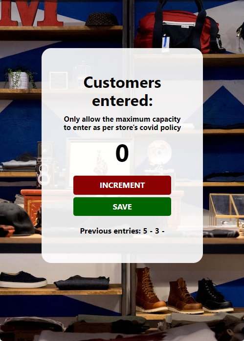

# Customer Counter

A counter app for store associate to use in order to track how many customers entered in the store especially during the pandemic when there was a limit to the maximum capacity of people in a store.

**Link to project:**

## How's it made

**Tech used:** HTML, CSS, JavaScript
